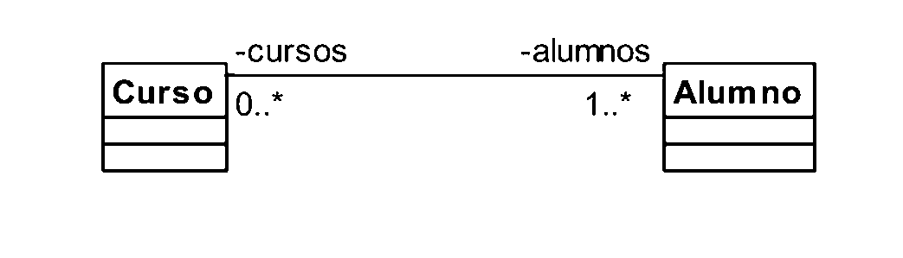
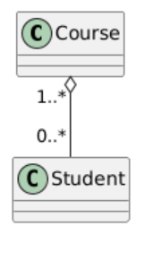
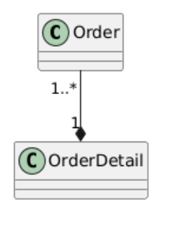

# Relaciones avanzadas entre clases

# Asociación en Programación Orientada a Objetos

<!-- Espacio para imagen del diagrama de clases (Asociación) -->


## ¿Qué es la asociación?

La **asociación** es una relación entre dos clases donde un objeto **usa o conoce a otro**, pero **no existe una dependencia fuerte** entre ellos.

- No hay relación de propiedad
- No hay control del ciclo de vida
- Es la forma más básica de relación entre clases

En términos simples:

> Un objeto se relaciona con otro para cumplir una funcionalidad.


## Características clave

- Las clases son **independientes**
- Los objetos pueden existir por separado
- La relación puede ser:
  - Unidireccional (una clase conoce a la otra)
  - Bidireccional (ambas clases se conocen)
- No implica “todo-parte”


## Ejemplo conceptual

Un estudiante puede estar inscrito en varios cursos, y un curso puede tener varios estudiantes.




## Ejemplo en código (usando arreglos)

### Clase Course

```java
public class Course {
    private String name;

    public Course(String name) {
        this.name = name;
    }

    public String getName() {
        return name;
    }
}
```
Clase Student

```java
public class Student {
    private String name;
    private Course[] courses;
    private int count; // controla cuántos cursos hay realmente

    public Student(String name, int maxCourses) {
        this.name = name;
        this.courses = new Course[maxCourses];
        this.count = 0;
    }

    public void addCourse(Course course) {
        if (count < courses.length) {
            courses[count] = course;
            count++;
        } else {
            System.out.println("No se pueden agregar más cursos");
        }
    }

    public void showCourses() {
        System.out.println("Cursos de " + name + ":");
        for (int i = 0; i < count; i++) {
            System.out.println("- " + courses[i].getName());
        }
    }
}
```

Uso del programa

```java
public class Main {
    public static void main(String[] args) {

        Course c1 = new Course("Java");
        Course c2 = new Course("Python");

        Student s1 = new Student("Ana", 5);

        s1.addCourse(c1);
        s1.addCourse(c2);

        s1.showCourses();
    }
}
```
## Análisis del ejemplo
* Student tiene una referencia a varios objetos Course
* Course no depende de Student
* Ambos objetos se crean de manera independiente
* La relación existe solo porque uno usa al otro

Esto representa una asociación, porque:

* No hay propiedad
* No hay dependencia de vida
* Solo hay colaboración entre objetos

# Agregación en Programación Orientada a Objetos

<!-- Espacio para imagen del diagrama de clases (Agregación) -->


## ¿Qué es la agregación?

La **agregación** es una relación especial de asociación que representa una relación **todo - parte débil**.

Esto significa que un objeto (el todo) contiene a otros objetos (las partes), pero:

- Las partes **pueden existir sin el todo**
- No hay una dependencia fuerte en el ciclo de vida

En términos simples:

> Un objeto agrupa a otros, pero no es dueño de ellos.


## Características clave

- Relación “todo - parte”
- Las partes se crean **fuera del contenedor**
- El contenedor **solo mantiene referencias**
- Las partes pueden:
  - Existir sin el contenedor
  - Ser compartidas con otros objetos
- No hay control del ciclo de vida


## Ejemplo conceptual

Un curso tiene estudiantes, pero los estudiantes existen independientemente del curso.




## Ejemplo en código (usando arreglos)

### Clase Student

```java
public class Student {
    private String name;

    public Student(String name) {
        this.name = name;
    }

    public String getName() {
        return name;
    }
}

```
Clase Course (Agregación)

```java
public class Course {
    private String name;
    private Student[] students;
    private int count;

    public Course(String name, Student[] students) {
        this.name = name;
        this.students = students; // recibe objetos creados afuera
        this.count = students.length;
    }

    public void showStudents() {
        System.out.println("Estudiantes en " + name + ":");
        for (int i = 0; i < count; i++) {
            System.out.println("- " + students[i].getName());
        }
    }
}
```

Uso del programa

```java
public class Main {
    public static void main(String[] args) {

        // Los estudiantes se crean fuera del Course
        Student s1 = new Student("Ana");
        Student s2 = new Student("Luis");

        // Se crea el arreglo externamente
        Student[] group = {s1, s2};

        // El Course recibe el arreglo (no crea los estudiantes)
        Course course = new Course("Java", group);

        course.showStudents();
    }
}
```

### Análisis del ejemplo
* Los objetos Student se crean antes del Course
* El Course no usa new Student()
* El Course solo recibe un arreglo con referencias
* Los estudiantes pueden existir sin el curso

Esto representa una agregación, porque:

* No hay propiedad sobre los objetos
* No hay control del ciclo de vida
* Los objetos pueden compartirse o reutilizarse

# Composición en Programación Orientada a Objetos

<!-- Espacio para imagen del diagrama de clases (Composición) -->


## ¿Qué es la composición?

La **composición** es una relación fuerte de tipo **todo - parte**, donde un objeto (el todo) es **dueño** de otros objetos (las partes).

Esto implica que:

- Las partes **no existen sin el todo**
- El objeto contenedor **controla su creación**
- Existe una **dependencia fuerte del ciclo de vida**

En términos simples:

> Un objeto está compuesto por otros objetos que no pueden existir de manera independiente.


## Características clave

- Relación “todo - parte” fuerte
- Las partes se crean **dentro del contenedor**
- El contenedor **controla completamente** a las partes
- No hay reutilización externa de las partes
- Hay dependencia del ciclo de vida


## Ejemplo conceptual

Un pedido tiene detalles de pedido, pero los detalles no existen sin el pedido.




## Ejemplo en código (usando arreglos)

### Clase OrderDetail

```java
public class OrderDetail {
    private String product;
    private int quantity;

    public OrderDetail(String product, int quantity) {
        this.product = product;
        this.quantity = quantity;
    }

    public String getProduct() {
        return product;
    }

    public int getQuantity() {
        return quantity;
    }
}
```

Clase Order (Composición)
```java
public class Order {
    private int orderId;
    private OrderDetail[] details;
    private int count;

    public Order(int orderId, int maxDetails) {
        this.orderId = orderId;
        this.details = new OrderDetail[maxDetails];
        this.count = 0;
    }

    public void addDetail(String product, int quantity) {
        if (count < details.length) {
            // El Order crea internamente los detalles
            details[count] = new OrderDetail(product, quantity);
            count++;
        } else {
            System.out.println("No se pueden agregar más detalles");
        }
    }

    public void showDetails() {
        System.out.println("Detalles del pedido " + orderId + ":");
        for (int i = 0; i < count; i++) {
            System.out.println("- " + details[i].getProduct() +
                               " | Cantidad: " + details[i].getQuantity());
        }
    }
}
```

Uso del programa

```java
public class Main {
    public static void main(String[] args) {

        Order order = new Order(1, 5);

        // El Order crea internamente los objetos OrderDetail
        order.addDetail("Laptop", 1);
        order.addDetail("Mouse", 2);

        order.showDetails();
    }
}
```

### Análisis del ejemplo
* OrderDetail no se crea fuera del Order
* El método addDetail usa new OrderDetail(...)
* El Order controla completamente los objetos que contiene
* No es posible reutilizar los detalles en otro Order

Esto representa una composición, porque:

* Hay propiedad sobre los objetos
* Hay control del ciclo de vida
* Las partes no existen sin el todo


# Ejercicios Progresivos: Identificar Asociación, Agregación y Composición

## Instrucciones generales

Para cada ejercicio:

1. Lee el escenario o analiza el código.
2. Identifica el tipo de relación:
   - Asociación
   - Agregación
   - Composición
3. Justifica tu respuesta respondiendo:
   - ¿Quién crea los objetos?
   - ¿Pueden existir de forma independiente?
   - ¿Hay relación de propiedad?

---

# Nivel 1: Reconocimiento básico (conceptual)

## Ejercicio 1

Un profesor usa un proyector en clase. El proyector no pertenece al profesor y puede ser usado por otros profesores.

**Pregunta:**
¿Qué tipo de relación hay entre `Profesor` y `Proyector`?


---

## Ejercicio 2

Un computador tiene un procesador. El procesador forma parte del computador y no se usa de forma independiente.

**Pregunta:**
¿Qué tipo de relación hay entre `Computador` y `Procesador`?


---

## Ejercicio 3

Un cliente puede realizar compras en una tienda. La tienda registra los clientes, pero los clientes existen aunque no compren.

**Pregunta:**
¿Qué tipo de relación hay entre `Cliente` y `Tienda`?


---

## Ejercicio 4

Un equipo de fútbol tiene jugadores. Los jugadores pueden cambiar de equipo o existir sin uno.

**Pregunta:**
¿Qué tipo de relación hay entre `Equipo` y `Jugador`?


---

# Nivel 2: Análisis de código

## Ejercicio 5

```java
public class Engine {
    private String type;

    public Engine(String type) {
        this.type = type;
    }
}

public class Car {
    private Engine engine;

    public Car() {
        engine = new Engine("V8");
    }
}
```
Pregunta:
¿Qué tipo de relación existe entre Car y Engine? Justifica.

## Ejercicio 
```java
public class Book {
    private String title;

    public Book(String title) {
        this.title = title;
    }
}

public class Library {
    private Book[] books;

    public Library(Book[] books) {
        this.books = books;
    }
}
```
Pregunta:
¿Qué tipo de relación existe entre Library y Book? Justifica.

## Ejercicio 7
```java
public class Player {
    private String name;

    public Player(String name) {
        this.name = name;
    }
}

public class Team {
    private Player[] players;
    private int count;

    public Team(int size) {
        players = new Player[size];
        count = 0;
    }

    public void addPlayer(String name) {
        players[count] = new Player(name);
        count++;
    }
}
```
Pregunta:
¿Qué tipo de relación existe entre Team y Player? Justifica.

### Nivel 3: Diseño (pensamiento aplicado)

## Ejercicio 9

Diseña la relación entre Pedido y Producto en un sistema de ventas donde:

Un producto existe independientemente
Un pedido puede tener varios productos
Los productos pueden estar en muchos pedidos

Pregunta:
¿Qué tipo de relación usarías y por qué?

## Ejercicio 10

Diseña la relación entre Casa y Habitación donde:

Una casa tiene habitaciones
Las habitaciones no tienen sentido sin la casa

Pregunta:
¿Qué tipo de relación usarías y por qué?

## Ejercicio 11

Diseña la relación entre Universidad y Profesor donde:

Un profesor puede trabajar en distintas universidades a lo largo del tiempo
La universidad no crea al profesor

Pregunta:
¿Qué tipo de relación usarías y por qué?

## Ejercicio 12

Diseña la relación entre Factura y DetalleFactura donde:

El detalle solo existe dentro de la factura
No tiene sentido fuera de ella

Pregunta:
¿Qué tipo de relación usarías y por qué?


